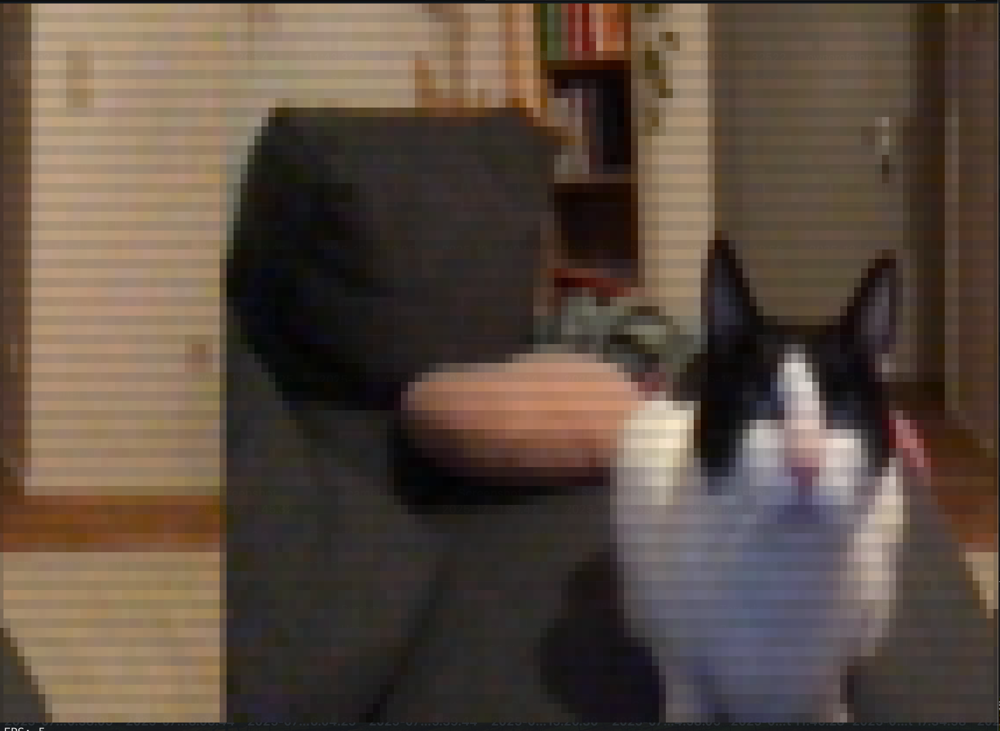
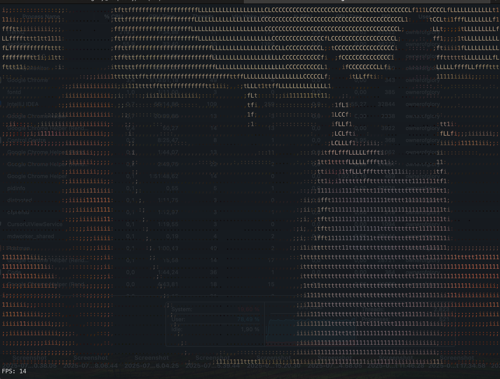

# Go ASCII-cam + GStreamer demo

Example of playing video from GStreamer pipeline right in the terminal

Based on **[muesli: asciicam](https://github.com/muesli/asciicam)**


## Build
```shell
go build -o asciicam
```

## Usage
```shell
./asciicam \
  -gst \
  -camWidth=320 \
  -camHeight=180 \
  -gst-pipeline <GStreamer_pipeline> # set your custom GStreamer pipeline
  -fps
```


## Test on MacOS with GStreamer Pipeline
### ANSI mode
```shell
./asciicam \
  -gst \
  -camWidth=320 \
  -camHeight=180 \
  -gst-pipeline 'avfvideosrc device-index=0 ! videoconvert ! videoscale ! video/x-raw,format=RGB,width=320,height=180,framerate=30/1 ! queue max-size-buffers=1 max-size-time=0 max-size-bytes=0 ! fdsink fd=1 sync=false' \
  -fps -ansi
```

**Example result**



### ASCII mode
```shell
./asciicam \
  -gst \
  -camWidth=320 \
  -camHeight=180 \
  -gst-pipeline 'avfvideosrc device-index=0 ! videoconvert ! videoscale ! video/x-raw,format=RGB,width=320,height=180,framerate=30/1 ! queue max-size-buffers=1 max-size-time=0 max-size-bytes=0 ! fdsink fd=1 sync=false' \
  -fps
```

**Example result**


